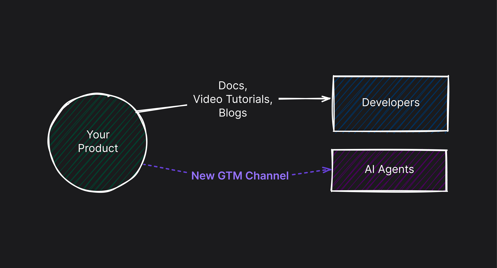

<head>
  <title>Layer AI Blog | AI Go-To-Market: Why Agents Are Your Newest Path to Adoption</title>
  <meta name="title" property="og:title" content="Layer AI Blog | AI Go-To-Market: Why Agents Are Your Newest Path to Adoption" />
  <meta name="image" property="og:image" content="https://storage.googleapis.com/generic-assets/blog-static-assets/ai_gtm.png" />
  <meta name="author" content="Jonah Katz" />
</head>

For years I’ve seen companies zeroing in on **developer experience**—crafting better docs, building language-specific SDKs, reducing friction in signups. But now, the biggest shift I’m seeing isn’t just about developers; it’s about AI. If you have an API or dev tool, it’s no longer humans alone reading your docs or signing up on your dashboard.

Increasingly, it’s **AI agents**—like GitHub Copilot, Cursor, or more autonomous “prompt-to-app” builders—spinning up resources and writing code automatically, often from inside IDEs. And if those AI agents don’t recognize your product or can’t easily use it, you’re out of the running before a human even knows you exist.

This is why I call it **AI Go-To-Market:** The path that used to run through documentation, blog posts, or word-of-mouth now runs straight through AI agents. In some scenarios—particularly with “prompt-to-app” builders like Lovable—agents can even decide which API to integrate, potentially bypassing your product if it’s not AI-friendly. Meanwhile, other tools (like Copilot or Cursor) handle tasks for developers who never even need to see your UI. So unless you adapt to these agentic workflows, you risk missing out on net-new usage and customers you never knew existed.

## A New Persona: The AI Agent

I’ve started thinking of AI agents as a brand-new persona—akin to a developer, but lacking all the human intuition. Agents rely on structured instructions, frictionless signups, and machine-friendly docs to parse your product. As Resend Founder Zeno Rocha [notes](https://resend.com/blog/agent-experience), agentic AI tools “rely on an LLM-readable format, like llms.txt, to operate efficiently.” So if your platform is confusing or locked behind manual forms, the agent moves on—often without you realizing you lost that opportunity.

I’ve seen this play out firsthand. At Layer, we build Copilot extensions (and other AI integrations) for companies that want to leverage AI agents to scale their go-to-market motion. When we worked with Neon, for instance, [we built a GitHub Copilot extension](https://docs.buildwithlayer.com/layer_neon_copilot_extension) so devs could simply type “@Neon” to create or manage their databases—right in Copilot’s chat. Many of them never even opened Neon’s dashboard. **That’s AI go-to-market in action:** the agentic workflow delivers brand-new usage directly from GitHub Copilot.

This shift can be surprising—both to us and to the companies investing in AI GTM. Netlify, for instance, is [seeing over 1,000 new sites created daily](https://biilmann.blog/articles/introducing-ax/) through their ChatGPT plugin—showing how agents bypass many “traditional” sign-up flows. We used to assume human-readable docs were the key primitive for driving API adoption. Now, we see AI agents taking a lead role in “using” and “selling” products, often bypassing the usual onboarding steps. It’s a new funnel that can make API onboarding and usage dramatically more frictionless than anything we’ve seen.

## Why “Agentic” Tools Are Changing GTM

Instead of developers manually exploring your site, an AI agent tries to interpret your endpoints, figure out authentication, and deploy code for the user. Tools like Copilot or Cursor are already speeding up coding for experienced devs, while more autonomous “prompt-to-app builders” like [Lovable](https://lovable.dev) and [Bolt](https://bolt.new) let anyone type in a sentence and watch the AI wire up entire full-stack apps. Some companies quietly gain usage because an AI spontaneously integrated them; others lose out because they never built agent-facing logic in the first place.

:::note[Agent Experience: Early Builders in AX]

A handful of dev-tool companies are already tailoring their platforms for **agentic AI**. [Netlify’s CEO](https://biilmann.blog/articles/introducing-ax/) introduced the term **Agent Experience (AX)** to describe APIs that can be parsed and acted upon by AI with minimal human oversight. From [Stytch](https://stytch.com/blog/the-age-of-agent-experience/) focusing on secure logins for agents to Neon enabling AI-driven Postgres database tasks, and from [Convex](https://convex.dev/) shipping LLM-friendly docs to [Netlify](https://www.netlify.com/) and [Resend](https://resend.com/blog/agent-experience) rethinking frictionless onboarding—these teams are making agent readiness a core product principle. Meanwhile, [Anima](https://www.animaapp.com/) bridges design-to-code workflows so AI can generate front-ends, [Mastra](https://mastra.ai/) offers a TypeScript agent framework for building multi-agent systems, and [Liveblocks](https://liveblocks.io/blog) explores collaborative features that AI tools can tap into.

All of this is coming together at [agentexperience.ax](https://agentexperience.ax/), a community where tech founders and AI engineers are sharing practical tips, open standards, and real-world examples of “LLM-ready” integration. Whether it’s measuring AX success or incorporating open protocols, the collective goal is to help AI agents navigate and utilize platforms more autonomously. It’s a growing movement that underscores a key insight: if you want your product to appear on an AI agent’s radar, your API needs to be agent-friendly from the ground up.
:::

## IDEs vs. Prompt-to-App Builders

I break the “agentic AI” environment into two main categories.

First, there are **AI-enhanced IDEs** (e.g., GitHub Copilot, Cursor) that help devs code faster by generating snippets or letting them type “@YourProduct” to do tasks. This might not yield massive net-new signups, but it’s fantastic for removing friction and improving DX for devs already considering your tool.

Second, there are **prompt-to-app builders** that can bring real net-new adoption, because they auto-generate entire projects or workflows. If your product is recognized as the best fit, the AI just picks it—often without the user manually researching your docs or anything else.

## The Emergence of “LLMs.txt” and Other Standards

People keep floating new proposals like “LLMs.txt” (for providing an AI-friendly index of your docs) or more formal protocols like Anthropic’s Model Context Protocol. Regardless of which approaches stick, the takeaway is simple: we’re no longer just speaking to human devs. We’re also speaking to software that tries to parse our docs and hit our endpoints automatically. If we don’t make that easy—through well-defined endpoints, frictionless signup, and extensions for AI tools—we’re invisible to the agent.

## Conclusion: A Shift in Mindset

Adapting to an **AI Go-To-Market** strategy doesn’t mean ditching your docs or ignoring developers. It means adding another layer—“agentic” integrations that allow popular AI tools to actually interact with your API in a way that makes sense. That might be a GitHub Copilot extension, a specialized plugin for ChatGPT, or a standard file like “llms.txt.” Once you’re agent-friendly, you become part of the new funnel developers are increasingly relying on.

I’ve seen personally just how powerful this can be. Companies that invest in these agentic workflows see devs adopt their product faster, often skipping the “human read the docs” stage entirely. In many ways, AI tools are becoming the new “workspace” for developers—if your product isn’t easily discoverable or usable from inside these AI-driven environments, you won’t appear in their pipeline. It’s not a matter of hype; it’s already happening. If your platform isn’t ready for the next wave of AI-centric adoption, you risk losing out on devs who rely on AI agents for most of their coding and decision-making. **AI is a new distribution channel**—treat it as such, stay ahead of the curve, and see usage and revenue grow.
