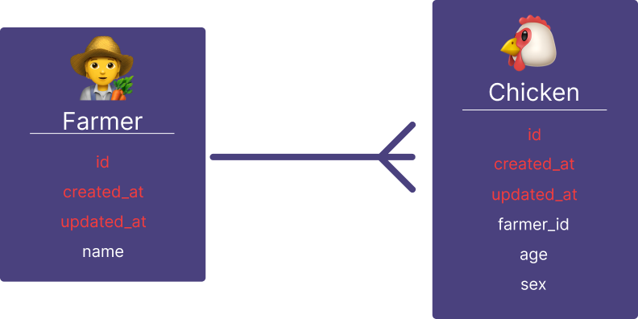
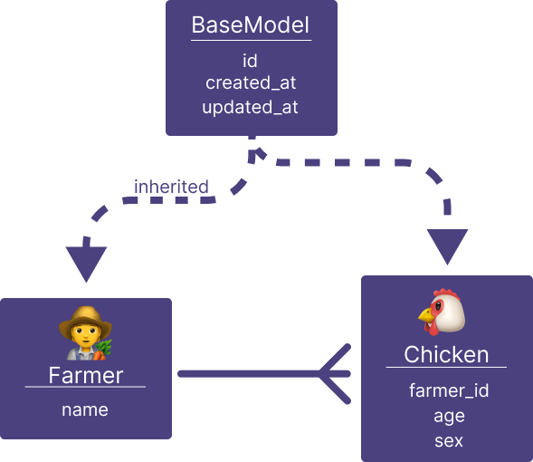
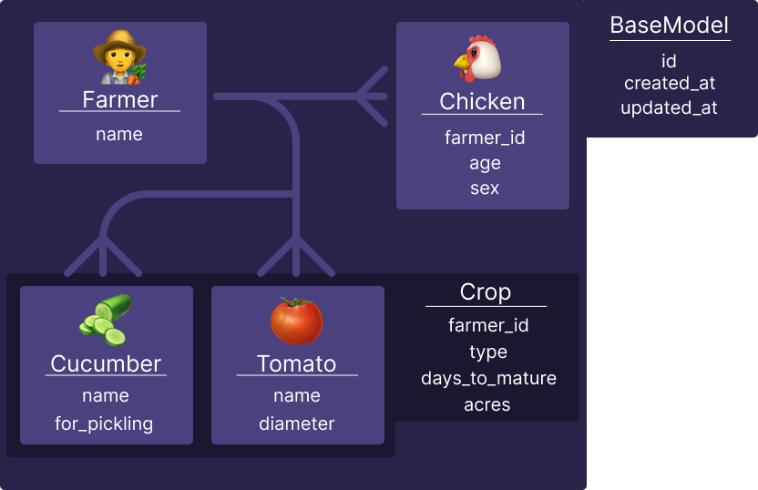

<small>
**Lead Author:** Gavyn<br/>
**Co-Authors:** Lucas, Andrew<br/>

Associated Repository: [blog-dry_api_flask_demo](https://github.com/buildwithlayer/blog-dry_api_flask_demo)<br/>
</small>


import Tabs from '@theme/Tabs';
import TabItem from '@theme/TabItem';

## ☔️ When it starts to rain 
When working with a traditional [Model/View/Controller](https://en.wikipedia.org/wiki/Model%E2%80%93view%E2%80%93controller) approach, 
it is easy to fall suspect to code duplication. I've
seen it with coworkers, friends, and even family. No one is safe from code duplication. However, there are some tips and
tricks you can use with Flask to help protect yourself and your loved ones.

## Data Sources
First, let's talk about where data comes from and how it can trick us into making the same models multiple times.

### Database + SQLAlchemy

The main source of data in most backends is a database (it's in the name). If you've been around the block and done more
than a few python APIs, you're probably familiar with tools like [Flask](https://flask.palletsprojects.com/en/) and [SQLAlchemy](https://www.sqlalchemy.org/). SQLAlchemy is great to help you
model and manage data in your database without ever writing a line of SQL, and that's every developer's dream.

When working with Flask and SQLAlchemy, you'll often see ORM models like this:


```python
class Farmer(db.Model):
    id: Mapped[int] = mapped_column(
        Integer, primary_key=True,
    )
    created_at: Mapped[DateTime] = mapped_column(
        DateTime, nullable=False, server_default=func.now(),
    )
    updated_at: Mapped[DateTime] = mapped_column(
        DateTime, nullable=False, server_default=func.now(), onupdate=func.now(),
    )
    name: Mapped[str] = mapped_column(
        String, nullable=False,
    )
```

And this is great! You've got an abstraction of the columns in your `farmer` table. Not only can you read, create,
update, and delete your farmers from your database with ease, but you can also make changes to the table itself, and
SQLAlchemy will help you migrate your data. Very developer friendly and very useful!

### APIs + Marshmallow

The next source of data in any API backend is the APIs themselves! You've got two categories of data: requests and
responses. In many cases, developers follow a model/view/controller pattern, and the GET routes are returning something
nearly identical to the ORM model.

Let's extend our example:

```python
farmers_bp = APIBlueprint(
    "farmers", __name__, enable_openapi=True
)

# Marshmallow Schema
class FarmerOut(Schema):
    id = fields.Integer(required=True)
    created_at = fields.DateTime(required=True)
    updated_at = fields.DateTime(required=True)
    name = fields.String(required=True)

# Flask Route
@farmers_bp.get("/<int:farmer_id>")
@farmers_bp.output(FarmerOut)
def get_farmer_by_id(farmer_id: int):
    farmer = Farmer.query.where(Farmer.id == farmer_id).first()
    if farmer is None:
        raise HTTPError(404, message="Farmer not found")
    return farmer
```

Now if there exists a record in our database, we can ping `farmers/1` and get the following response:

```js
{
  "created_at": "2023-12-12T15:51:00",
  "id": 1,
  "name": "Old MacDonald",
  "updated_at": "2023-12-12T15:51:00"
}
```

### 🌊 Monsoon Season 

The well-seasoned developer might dust off their salt and pepper and say, "Wait! I've seen those same fields before!"
And they'd be right! Looking at the `Farmer` class and the `FarmerOut` class, the fields are nearly identical.


<Tabs>
  <TabItem value="orange" label="SQLAlchemy" default>
    
    ```python
    # SQLAlchemy Schema
    class Farmer(db.Model):
        id: Mapped[int] = mapped_column(Integer, primary_key=True)
        created_at: Mapped[DateTime] = mapped_column(DateTime, nullable=False, server_default=func.now())
        updated_at: Mapped[DateTime] = mapped_column(DateTime, nullable=False, server_default=func.now(), onupdate=func.now())
        name: Mapped[str] = mapped_column(String, nullable=False)
    ```
  </TabItem>
  <TabItem value="apple" label="Marshmallow" >
    ```python
    # Marshmallow Schema
    class FarmerOut(Schema):
        id = fields.Integer(required=True)
        created_at = fields.DateTime(required=True)
        updated_at = fields.DateTime(required=True)
        name = fields.String(required=True)
    ```
  </TabItem>
</Tabs>

This is definitely a bad look. Imagine if we were to add a new field to the `Farmer` class? Or even more sneaky, change
the type of one of the fields? We'd then have to update `FarmerOut` and any other schemas we may have in the future that
include `Farmer` to match. This is a burden on developers, but it also is a chance for subtle bugs to creep in.

## Buy 1, Get 1 Free!

Thankfully, we have some tools at our disposal to help avoid this kind of disaster. Enter [`SQLAlchemyAutoSchema`](https://marshmallow-sqlalchemy.readthedocs.io/en/latest/api_reference.html), stage
left. Let's look at how we can use [`flask-marshmallow`](https://flask-marshmallow.readthedocs.io/en/latest/) and `SQLAlchemyAutoSchema` to help avoid all this duplication.

### Simple Example

Below our `Farmer` definition, we can add a new class for the `FarmerSchema` as follows:

```python
class FarmerSchema(marsh.SQLAlchemyAutoSchema):
    class Meta:
        model = Farmer
```

Then, we just update our route to use this new schema:

```python
@farmers_bp.get("/<int:farmer_id>")
@farmers_bp.output(FarmerSchema) # <-- Updated
def get_farmer_by_id(farmer_id: int):
    farmer = Farmer.query.where(Farmer.id == farmer_id).first()
    if farmer is None:
        raise HTTPError(404, message="Farmer not found")
    return farmer
```

And now, if we were to ping the same request as before, we get the same response! This is thanks to the
`SQLAlchemyAutoSchema` automatically parsing all the properties of the associated `model` (passed in its `Meta` class).
This means any new fields added to our ORM model will be automatically added to our schema!

### Relationships

Let's add a new ORM model that has a many-to-one relationship with the `Farmer`, such as chickens.

<Tabs>
  <TabItem value="image" label="Image" default>
    <div style={{"text-align": "center"}}>
        
    </div>
  </TabItem>
  <TabItem value="code" label="Code">
  
    ```python
    class Sex(enum.Enum):
        MALE = "male"
        FEMALE = "female"


    class Chicken(db.Model):
        id: Mapped[int] = mapped_column(
            Integer, primary_key=True,
        )
        created_at: Mapped[DateTime] = mapped_column(
            DateTime, nullable=False, server_default=func.now(),
        )
        updated_at: Mapped[DateTime] = mapped_column(
            DateTime, nullable=False, server_default=func.now(), onupdate=func.now(),
        )
        farmer_id: Mapped[int] = mapped_column(
            Integer, ForeignKey("farmer.id", ondelete="CASCADE"),
        )
        age: Mapped[int] = mapped_column(
            Integer, nullable=False,
        )
        sex: Mapped[Sex] = mapped_column(
            Enum(Sex), nullable=False,
        )


    class ChickenSchema(marsh.SQLAlchemyAutoSchema):
        class Meta:
            model = Chicken
    ```
    
  </TabItem>
</Tabs>

Oh no, it's starting to rain. We have duplication on some of our fields in the model (`id`, `created_at`, `updated_at`),
but we are seasoned developers, and we know we can just abstract that out to a `BaseModel` of sorts. No biggie!

<Tabs>
    <TabItem value="image" label="Image" default>
        <div style={{"text-align": "center"}}>
            
        </div>
    </TabItem>
    <TabItem value="code" label="Code">

    ```python
    class BaseModel(db.Model):
        id: Mapped[int] = mapped_column(
            Integer, primary_key=True,
        )
        created_at: Mapped[DateTime] = mapped_column(
            DateTime, nullable=False, server_default=func.now(),
        )
        updated_at: Mapped[DateTime] = mapped_column(
            DateTime, nullable=False, server_default=func.now(), onupdate=func.now(),
        )

        # --- METADATA ---
        __abstract__ = True
    ```

    </TabItem>
</Tabs>
And then we just inherit from the `BaseModel` for both `Farmer` and `Chicken`. Easy! The `Farmer` class is looking very
simple now, which is good.

```python
class Farmer(BaseModel):
    name: Mapped[str] = mapped_column(
        String, nullable=False,
    )

    # --- RELATIONSHIPS ---
    chickens: Mapped[List[Chicken]] = relationship(
        "Chicken", cascade="all, delete",
    )
```

But what about the duplication of the `Schema` classes we are making? They are the same each time, except the
`Meta.model` points to whichever model the schema belongs to. How could we extract this out to reduce duplication? Well,
know that we have a `BaseModel`, let's just give it a `classmethod` that generates our `Schema` class for us!

```python
class BaseMeta(object):
    include_relationships = True


class BaseModel(db.Model):
    ...
    __schema__ = None
    
    @classmethod
    def make_schema(cls) -> type(SQLAlchemyAutoSchema):
        if cls.__schema__ is not None:
            return cls.__schema__
        
        meta_kwargs = {
            "model": cls,
        }
        meta_class = type("Meta", (BaseMeta,), meta_kwargs)
        
        schema_kwargs = {
            "Meta": meta_class
        }
        schema_name = f"{cls.__name__}Schema"
        
        cls.__schema__ = type(schema_name, (SQLAlchemyAutoSchema,), schema_kwargs)
        return cls.__schema__
```

This is a pretty crafty method that creates a customer `Meta` class for the given `cls`, and then uses that in a custom
`SQLAlchemyAutoSchema` class, which is then returned. We can now set the `FarmerSchema` and `ChickenSchema` as follows:

```python
FarmerSchema = Farmer.make_schema()
ChickenSchema = Chicken.make_schema()
```

Now, let's add a couple of chickens for the farmer in our database, and test out the same endpoint. Here is the
response:

```js
{
  "chickens": [
    1,
    2
  ],
  "created_at": "2023-12-12T15:51:00",
  "id": 1,
  "name": "Old MacDonald",
  "updated_at": "2023-12-12T15:51:00"
}
```

What's going on here? We have the `include_relationships` property in `FarmerSchema.Meta`, so why are we only getting
the `id` of each `Chicken`? Unfortunately, the way to get composition relationships in `marshmallow.Schema` is through
`Nested` fields. There is no auto translation of `SQLAlchemy.relationship()` to `marshmallow.fields.Nested`, but we are
clever developers, right? We can figure something out.

```python
class BaseModel(db.Model):
    ...
    @classmethod
    def get_relationship(cls, attr_name: str) -> Optional[Relationship]:
        attr = getattr(cls, attr_name)
        prop = getattr(attr, "property", None)
        if prop is None or not isinstance(prop, Relationship):
            return None
        return prop
    
    @classmethod
    def nest_attribute(cls, attr_name: str, prop: Relationship, schema_kwargs: dict):
        many = getattr(prop, "collection_class", None) is not None
        entity = getattr(prop, "entity", None)
        nested_class = getattr(entity, "class_", None)
        if not hasattr(nested_class, "make_schema"):
            raise TypeError(f"Unexpected nested type [{type(nested_class).__name__}]")

        schema_kwargs[attr_name] = fields.Nested(
            nested_class.make_schema()(many=many)
        )
    
    @classmethod
    def make_schema(cls) -> type(SQLAlchemyAutoSchema):        
        ... # same as before

        # Add relationships to the schema
        for attr_name in cls.__dict__:
            if (prop := cls.get_relationship(attr_name)) is not None:
                cls.nest_attribute(attr_name, prop, schema_kwargs)

        cls.__schema__ = type(schema_name, (SQLAlchemyAutoSchema,), schema_kwargs)
        return cls.__schema__
```

This new `make_schema()` method will automatically detect any fields that are `SQLAlchemy.Relationships`, and convert
them to the appropriate `marshmallow.fields.Nested()` as long as the class inherits from `BaseModel`. Pretty nifty!

Now, if we make the same request as before, let's see what we get:

> TypeError: Object of type Sex is not JSON serializable

Not the first time I've heard that. Let's see what we can do to fix this. The issue is very similar to the relationship
vs. nested problem we saw before. `SQLAlchemy` has one notion of an `Enum`, while `marshmallow` has another. We can do a
similar conversion within our `make_schema` function as follows:

```python
class BaseModel(db.Model):
    ... # same as before
    @classmethod
    def get_enum(cls, attr_name: str) -> Optional[Type[Enum]]:
        attr = getattr(cls, attr_name)
        attr_type = getattr(attr, "type", None)
        if attr_type is None:
            return None

        return getattr(attr_type, "enum_class", None)

    @classmethod
    def enum_attribute(cls, attr_name: str, enum_class: Type[Enum], schema_kwargs: dict):
        schema_kwargs[attr_name] = fields.Enum(enum_class)

    @classmethod
    def make_schema(cls) -> type(SQLAlchemyAutoSchema):
        ... # same as before

        for attr_name in cls.__dict__:
            if (prop := cls.get_relationship(attr_name)) is not None:
                cls.nest_attribute(attr_name, prop, schema_kwargs)
            elif (enum_class := cls.get_enum(attr_name)) is not None:
                cls.enum_attribute(attr_name, enum_class, schema_kwargs)

        cls.__schema__ = type(schema_name, (SQLAlchemyAutoSchema,), schema_kwargs)
        return cls.__schema__
```

Now, when we make the same request, we get:

```js
{
  "chickens": [
    {
      "age": 3,
      "created_at": "2023-12-12T18:17:53",
      "id": 1,
      "sex": "MALE",
      "updated_at": "2023-12-12T18:17:53"
    },
    {
      "age": 2,
      "created_at": "2023-12-12T18:46:30",
      "id": 2,
      "sex": "FEMALE",
      "updated_at": "2023-12-12T18:46:30"
    }
  ],
  "created_at": "2023-12-12T15:51:00",
  "id": 1,
  "name": "Old MacDonald",
  "updated_at": "2023-12-12T15:51:00"
}
```

### Polymorphism

Now that our relationships are healthy, we can move to the next step: polymorphism! Let's say we don't want to just keep
track of farmers and their livestock, but also their crops! Well, `SQLAlchemy` has us covered with its `__mapper_args__`
metadata and the `polymorphic` fields of that object!

For our purposes, we want one generic `Crop` model that keeps track of the type of crop, the maturity time, and how many
acres a farmer has of that crop.
<Tabs>
  <TabItem value="image" label="Image" default>
    
  </TabItem>
  <TabItem value="code" label="Code">
    ```python
    class Crop(BaseModel):
        farmer_id: Mapped[int] = mapped_column(
            Integer, ForeignKey("farmer.id", ondelete="CASCADE"), nullable=False,
        )
        type: Mapped[str] = mapped_column(
            String, nullable=False,
        )
        days_to_mature: Mapped[int] = mapped_column(
            Integer, nullable=False,
        )
        acres: Mapped[float] = mapped_column(
            Float, nullable=False,
        )

        # --- METADATA ---
        __mapper_args__ = {
            "polymorphic_identity": "crop",
            "polymorphic_on": "type",
        }


    class Cucumber(Crop):
        id: Mapped[int] = mapped_column(
            Integer, ForeignKey("crop.id", ondelete="CASCADE"), primary_key=True,
        )
        for_pickling: Mapped[bool] = mapped_column(
            Boolean, default=False, nullable=False,
        )

        # --- METADATA ---
        __mapper_args__ = {"polymorphic_identity": "cucumber"}


    class Tomato(Crop):
        id: Mapped[int] = mapped_column(
            Integer, ForeignKey("crop.id", ondelete="CASCADE"), primary_key=True,
        )
        diameter: Mapped[float] = mapped_column(
            Float, nullable=False,
        )

        # --- METADATA ---
        __mapper_args__ = {"polymorphic_identity": "tomato"}
    ```
  </TabItem>


</Tabs>
Now, we also want to move all of our schema declarations into their own `schemas` module. After doing that, we create
the `CucumberSchema` and `TomatoSchema` as normal:

```python
CucumberSchema = Cucumber.make_schema()
TomatoSchema = Tomato.make_schema()
```

Everything is looking good, but there is trouble on the horizon. If we look at the generated schema for the `Farmer`,
something is off. The `crops` field says it is a list of `CropSchemas`, but this is only partially true. Ideally, the
`crops` field should be a list of either `TomatoSchemas` or `CucumberSchemas`.

## The Magic of OneOfSchema

Thankfully, there is already an extension to help us solve this problem; itroducing [`marshmallow_oneofschema`](https://github.com/marshmallow-code/marshmallow-oneofschema)!

### Polymorphism II: Even DRYer

To use the `OneOfSchema` class for our `CropSchema`, we just have to do the following:

```python
class CropSchema(OneOfSchema):
    type_schemas: Dict[str, str] = {
        "cucumber": CucumberSchema,
        "tomato": TomatoSchema,
    }

    type_field_remove = False

    def get_obj_type(self, obj: Crop):
        return obj.type
```

The `type_schemas` property is a mapping of the `type` field of a given `Crop` to which schema it should use when
serializing or deserializing. It's that simple! Unfortunately, this has one drawback when implementing into our given
stack: `make_schema()` does not know of `CropSchema's` existence. When creating the `FarmerSchema`, it will deduce the
class of the `crops` field, which is `Crop`, and then it will call `Crop.make_schema()` to get the nested schema.

This is no good! What can we do to fix this? Overrides.

```python
class BaseModel(db.Model):
    ... # same as before
    @classmethod
    def make_schema(cls, overrides: Optional[Dict[str, fields.Field]] = None) -> type(SQLAlchemyAutoSchema):
        ... # same as before

        for attr_name in cls.__dict__:
            if attr_name in overrides:
                schema_kwargs[attr_name] = overrides[attr_name]
            elif (prop := cls.get_relationship(attr_name)) is not None:
                cls.nest_attribute(attr_name, prop, schema_kwargs)
            elif (enum_class := cls.get_enum(attr_name)) is not None:
                cls.enum_attribute(attr_name, enum_class, schema_kwargs)

        cls.__schema__ = type(schema_name, (SQLAlchemyAutoSchema,), schema_kwargs)
        return cls.__schema__
```

This way, when we create the `FarmerSchema`, we can tell it specifically to use the polymorphic `CropSchema` for the
`crops` field.

```python
FarmerSchema = Farmer.make_schema(
    overrides={"crops": fields.Nested(CropSchema(), many=True)}
)
```

Now, when we call our endpoint, we get:

```js
{
  "chickens": [
    {
      "age": 3,
      "created_at": "2023-12-12T18:17:53",
      "id": 1,
      "sex": "MALE",
      "updated_at": "2023-12-12T18:17:53"
    },
    {
      "age": 2,
      "created_at": "2023-12-12T18:46:30",
      "id": 2,
      "sex": "FEMALE",
      "updated_at": "2023-12-12T18:46:30"
    }
  ],
  "created_at": "2023-12-12T15:51:00",
  "crops": [
    {
      "acres": 1,
      "created_at": "2023-12-12T20:21:32",
      "days_to_mature": 60,
      "for_pickling": true,
      "id": 1,
      "type": "cucumber",
      "updated_at": "2023-12-12T20:21:32"
    },
    {
      "acres": 0.5,
      "created_at": "2023-12-12T20:22:07",
      "days_to_mature": 80,
      "diameter": 3,
      "id": 2,
      "type": "tomato",
      "updated_at": "2023-12-12T20:22:07"
    }
  ],
  "id": 1,
  "name": "Old MacDonald",
  "updated_at": "2023-12-12T15:51:00"
}
```

Beautiful and dry! Like a sunny day! ☀️

## Mechanics (AKA Auto-Docs)

A fantastic feature of APIFlask is that it conforms to the OpenAPI spec with its routes and schemas. This means we've
actually been documenting our APIs the whole time as we write them! Here are the docs:

<iframe
        id="apiflask-docs"
        title="APIFLask Docs"
        src="https://dry-apiflask-demo-r5uz5svela-uc.a.run.app/docs#/"
        width="100%"
        height="500px"
>
</iframe>


### The First 90%

If you look around the auto generated docs, you'll see the routes that we made, as well as the schemas that are in use.
One quick change I'd suggest is to try out all the different UIs available for the docs site. You can update this by
setting the `docs_ui` key-word argument in the `APIFlask` constructor like so:

```python
APIFlask(__name__, title="DRY API", version="1.0", docs_ui="elements")
```

Developers with sharp eyes may notice that the `Crop` schema doesn't have any information populated in our docs! This is
a problem.

### The Last 10%

The final savior: [`apispec_oneofschema`](https://github.com/timakro/apispec-oneofschema), a companion to `marshmallow_oneofschema`. This plugin allows us to generate
documentation for our `OneOfSchema` schemas. Let's set it up now!

It's as simple as changing this:

```python
app = APIFlask(__name__, title="DRY API", version="1.0", docs_ui="elements")
```

To this:

```python
app = APIFlask(__name__, title="DRY API", version="1.0", docs_ui="elements", spec_plugins=[MarshmallowPlugin()])
```

### The last 1%

Lastly, the `oneOf` dropdown for most of the UIs just says `object` for each option, which isn't great. From what I can
tell, most of the UIs use the `title` field of a schema to populate the name, so we can create our own plugin to add
that field for each of our schemas:

```python
from apispec.ext import marshmallow


class OpenAPITitleAppender(marshmallow.OpenAPIConverter):
    def schema2jsonschema(self, schema):
        json_schema = super(OpenAPITitleAppender, self).schema2jsonschema(schema)
        schema_name = schema.__class__.__name__
        if schema_name.endswith('Schema'):
            schema_name = schema_name[:-len('Schema')]
        json_schema["title"] = schema_name
        return json_schema


class TitlesPlugin(marshmallow.MarshmallowPlugin):
    Converter = OpenAPITitleAppender
```

And then we just have to add it to our `APIFlask` app!

```python
app = APIFlask(
    __name__,
    title="DRY API",
    version="1.0",
    docs_ui="elements",
    spec_plugins=[MarshmallowPlugin(), TitlesPlugin()]
)
```