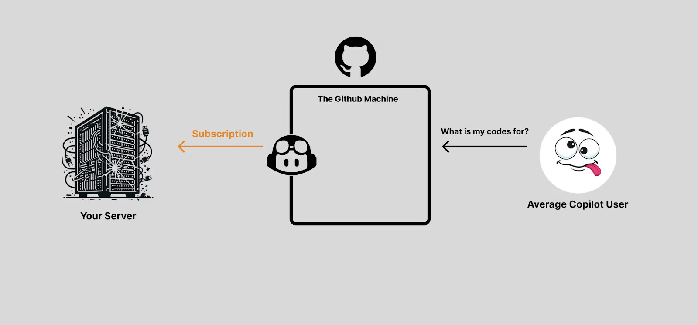

<head>
  <title>Layer AI Blog | How Layer Built Neon’s Copilot Extension</title>
  <meta name="title" property="og:title" content="Layer AI Blog | How Layer Built Neon’s Copilot Extension"></meta>
  <meta name="author" content="Andrew Hamilton"></meta>
</head>

_The following blog demonstrates how Layer created a GitHub Copilot extension for [Neon](https://neon.tech/), a serverless, open-source PostgreSQL database. We build Copilot extensions (and other AI integrations) for companies that want to embrace AI Agents in their go-to-market process. If you’d like to see how we can help, read on—or [book a demo](https://cal.com/team/layer/demo) to learn more._

## Turning your docs into AI integrations

As soon as GitHub Copilot burst onto the scene, teams started asking, “How do we teach Copilot about our platform?” Whether you’re offering a specialized set of APIs or, in Neon’s case, a managed Postgres service, developers increasingly want AI-driven integrations that bring your endpoints and best practices directly into their coding workflow. In other words, it’s no longer enough to rely on devs hunting through documentation and using products through the GUI.

That’s exactly where Layer fits in. 

We help companies build Copilot extensions—written in any language—that seamlessly inject your product’s logic into GitHub Copilot (and other AI surfaces, too, including Cursor, VS Code, ChatGPT, and more). Here are the steps we took to build **Neon’s** Copilot Extension—explaining why a “Copilot extension” isn’t always what you might expect.

## Prerequisites: Python, Ngrok

First, make sure that you have the latest versions of [Python](https://www.python.org/downloads/) and [Ngrok](https://ngrok.com/downloads/) installed onto your system.

## Webhook Subscriptions: Like Building a Discord Bot

If you’ve built a Discord bot before, you’re already familiar with this pattern: you set up a server, then point the platform at it so it can deliver events to your endpoint. That’s exactly how GitHub Copilot extensions work under the hood: You create a web server—written in any language you like—and subscribe it to events from GitHub. Whenever Copilot needs to query your extension, it fires an HTTP request to your server.

This “subscription” approach is powerful for two reasons:
1. **Language freedom.** Because all you need is a server that handles HTTP requests, you’re not locked into Python, Java, Node, or any specific tech stack. If you can spin up a server, you can handle Copilot extension calls—whether you prefer Go, OCaml, or even Ruby.
2. **Unlimited custom logic.** Once the requests arrive, it’s entirely up to you how to process them. Want to authenticate users, pull data from a Postgres database, or call a third-party API? Go for it. The webhook subscription doesn’t dictate how your code runs; it just ensures Copilot knows where to send requests.

In other words, the only thing you really need to do is let GitHub know where your server lives. Once that’s done, you can implement your Copilot “extension” in the language of your choice, and handle incoming Copilot requests in whatever way best suits your application’s needs.

## Our Server

Below is the starter code we used at **Layer** to help Neon’s team stand up their Copilot server. It accomplishes two main objectives:
1. **Expose** a /completion route for Copilot to hit via POST.
2. **Craft** a system message injected into the conversation to modify the AI’s response.

CLICK [HERE](https://neon.tech/blog/how-to-build-github-copilot-extensions) TO READ THE REST OF THE BLOG.