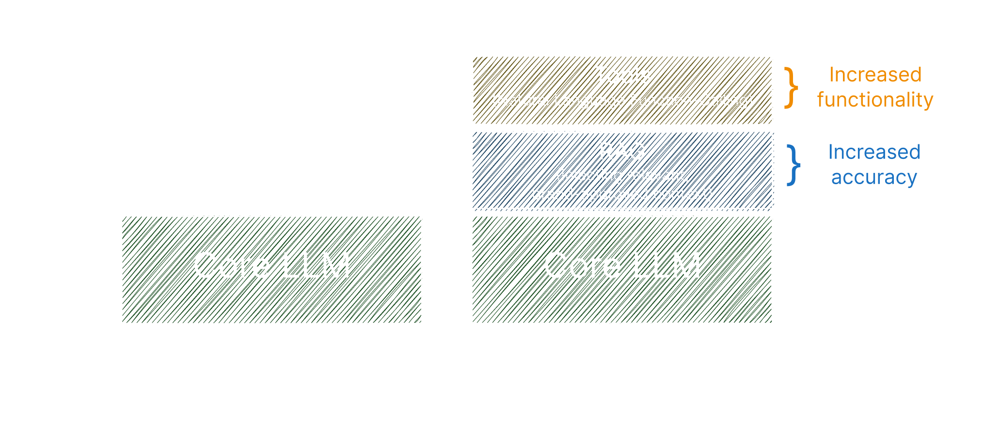

<head>
  <title>Layer AI Blog | What Is LLM Extensibility?</title>
</head>

import Tabs from '@theme/Tabs';
import TabItem from '@theme/TabItem';

## The Trust Gap in AI-Assisted Coding

Ask any developer who’s turned to an AI chatbot for coding help, and you’ll likely hear the same question, reverberating at various volumes in their heads: *“Can I really trust this snippet?”*

You never know if the chatbot is scraping outdated docs, merging conflicting tutorials, or pulling random code from unmaintained repos. Worse, you’re forced to juggle multiple platforms—IDE, browser, chat window—just to test and integrate those suggestions.

Nobody wants to waste hours verifying code that was supposed to save them time. That’s where LLM Extensibility steps in, bringing curated, brand-approved-and-controlled data that stays in sync across every AI environment you rely on. The result? A coding assistant you can actually trust, with fewer late-night debugging sessions and far less copy-paste chaos.

<Tabs>
  <TabItem value="standard" label="Standard LLM Coding Assistance" default>
   

        
    

  </TabItem>
  <TabItem value="extensibility" label="LLM Extension Coding Assistance" >
    

        
    

  </TabItem>
</Tabs>

## What Is LLM Extensibility—and Why Does It Matter?

**LLM Extensibility** is the process of embedding brand-approved, continuously updated knowledge and functionality directly into AI environments—so that developers, businesses, and AI platforms can collaborate more effectively. Instead of letting tools like ChatGPT or GitHub Copilot scrape the open web for partial information, LLM Extensibility ensures they always draw from the most reliable, real-time sources.

This means a single, consistent pipeline: when a company publishes official documentation, code samples, or best practices into an “LLM extension,” developers see the correct info wherever they use AI—whether that’s in VS Code, Copilot, ChatGPT, Anthropic, or any other AI surface. No guesswork, no stale references, and a drastically simpler way to trust the AI’s output.

## Everybody Wins: Unifying Brands, Developers, and AI Surfaces

When your API is constantly evolving (think Stripe, Plaid, Neon, or any fast-moving platform), it’s no small feat to keep docs consistent across various AI tools. Developers often piece together partially-hallucinated code snippets with trial and error, leading to bugs, confusion, and extra support overhead. LLM Extensibility solves that by offering a single source of truth for docs, code samples, and best practices—across every AI environment that matters. 
1. **Brands** gain direct control over how popular AI tools assist developers with their APIs and SDKs. By building extensions for ecosystems like ChatGPT, Claude, and GitHub Copilot, they embed up-to-date, brand-approved content and functionality right where developers live—ensuring consistency, reliability, and a smoother path to integration.
2. **Developers** can trust that what they’re pulling is always current and aligned with official best practices. Plus, the AI can do more than advise: it can open pull requests, run tests, or spin up resources in the developer’s environment, guided by reliable content.
3. **AI Surfaces** (VS Code, ChatGPT, GitHub Copilot, Anthropic, etc.) deliver a richer, more consistent user experience. Instead of scraping partial data and generating hallucinated code, they plug into a universal source of truth that updates in real time and brings powerful agentic functionality to their users.

Of course, not every AI platform has embraced extensibility yet. Some, like Cursor, remain closed off—for now. But as the [ecosystem around LLM extensibility grows](https://publish.obsidian.md/andrew-vault/Layer/Blogs/LLM+Extensibility-+Race+for+an+Ecosystem), user expectations will evolve, and every surface will likely open up to brand-specific extensions to stay competitive.

## Why Not Just “Ask ChatGPT”?

If ChatGPT (or another super powerful LLM) can browse the web, why bother with a brand-managed extension? The short answer is **reliability and control.**

Open-web crawling might yield half-correct references or piecemeal code that no longer matches a brand’s latest version. An official extension, on the other hand, feeds the AI precisely what the brand wants it to see—nothing more, nothing less.

For developers, that means fewer misfires. Instead of sifting through questionable snippets, they can rely on curated, brand-sanctioned responses. Couple that with the AI’s ability to manipulate files in your IDE or open pull requests in GitHub, and you’ve got an active collaborator rather than a passive advisor. You still oversee or approve changes, but the manual copy-paste grind disappears.

## One Extension, Many Surfaces—Build Once, Publish Everywhere

Yes, a company could build separate plugins for each AI environment—[VS Code extension](https://code.visualstudio.com/api/extension-guides/chat), [Github Copilot extension](https://github.com/marketplace?type=apps&copilot_app=true), [OpenAI GPT](https://chatgpt.com/gpts), [Anthropic MCP Server](https://github.com/modelcontextprotocol/servers)—and manually update each one whenever their docs or OpenAPI spec changes. But that approach is time-consuming and prone to version drift.

A **single publishing model** makes far more sense: create one extension (containing your official docs, code samples, or agentic actions), then **deploy** it to whichever AI surfaces you want to support. Whenever you update your docs or add new features, every environment reflects the change at once. It’s akin to how React Native lets you build an app once and distribute it to multiple platforms (iOS, Android, MacOS, Windows, and Web); here, you’re uploading and maintaining **brand** content and logic on one platform, and distributing to multiple AI tools with no code required.

This is the vision behind **platforms like Layer**, which aim to unify LLM Extensibility. Rather than building piecemeal integrations for each environment, you create a single extension—your “source of truth”—and publish it across supported surfaces from one central dashboard. Brands update content once, developers find consistent, up-to-date docs and agentic tools, and AI surfaces reap the benefits of official, high-quality knowledge.

<Tabs>
  <TabItem value="fragmented" label="Fragmented Distribution Model" default>
   

        
    

  </TabItem>
  <TabItem value="unified" label="Unified Distribution Model" >
    

        
    

  </TabItem>
</Tabs>

## Insights and Efficiency for Everyone

One huge benefit of LLM Extensibility is the **insight** it provides. Brands that control their extension can track real-world usage: which queries come up most often, which features confuse developers, and where the biggest gaps lie. That feedback loop shapes future documentation tweaks and even core product decisions.

Developers, meanwhile, can streamline their workflows. They no longer hunt down the right doc version or wonder if a snippet is still valid; the AI always references the latest info. And AI surfaces gain a reputation for **trustworthy** guidance, pulling from an official source rather than stitching together random web scraps.

## Where AI Goes from Here

We’re already seeing signs that AI can do more than suggest code—it can act. Opening pull requests, provisioning services, or orchestrating CI/CD pipelines are all becoming part of an LLM’s repertoire. **LLM Extensibility** paves the way for that evolution by grounding these actions in brand-approved data and logic. And as more AI surfaces become extensible, the line between “AI advice” and “AI-driven automation” continues to blur.

That’s good news for everyone in this conversation: brands, developers, and AI platform providers. With a unified extensibility model, changes happen once, code is consistently accurate, and developers can do more with less friction. Instead of scraping questionable snippets or juggling plugin updates, the future looks a lot more **connected**—and a lot more **trustworthy.**

That’s the essence of **LLM Extensibility:** a blueprint for AI that respects brand control, fosters developer confidence, and unlocks richer, continuously updated capabilities across all the surfaces where work actually happens. If you’re ready to leave behind scattered docs and fragmented plugin strategies, this could be the next big step toward a smarter, more seamless AI pipeline.
