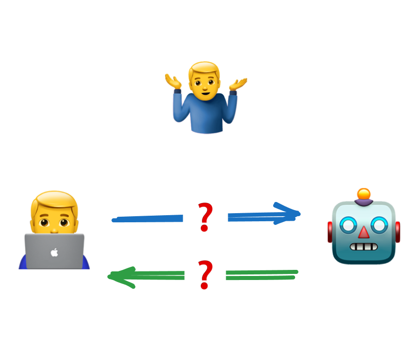
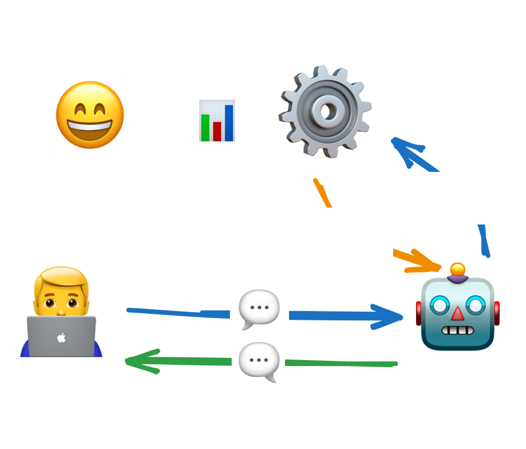
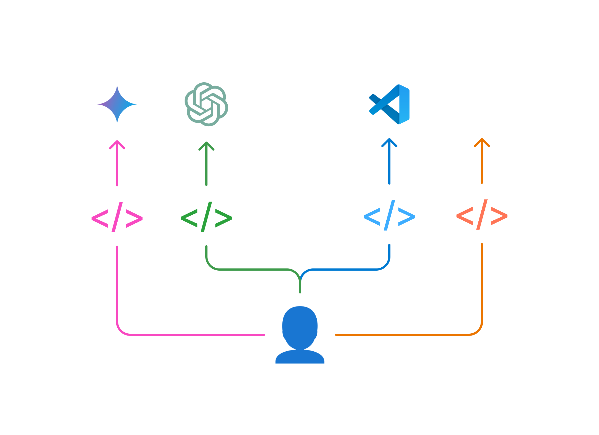
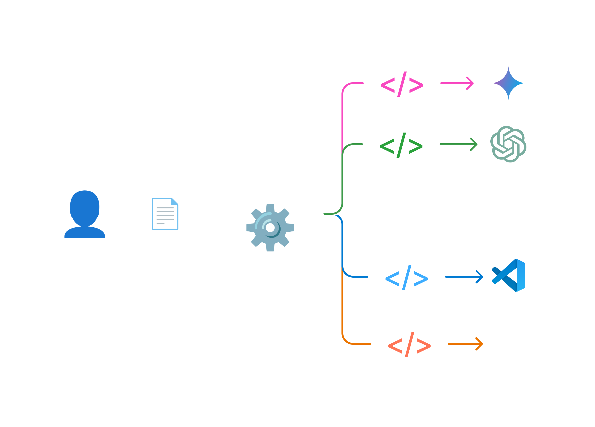

<head>
  <title>Layer AI Blog | Why LLM Extensibility is Vital to API Vendors</title>
  <meta name="title" property="og:title" content="Layer AI Blog | Why LLM Extensibility is Vital to API Vendors"></meta>
  <meta name="image" property="og:image" content="https://storage.googleapis.com/generic-assets/blog-static-assets/llm_extensibility_vital_og_image.png"></meta>
  <meta name="author" content="Jonah Katz, Andrew Hamilton"></meta>
</head>

import Tabs from '@theme/Tabs';
import TabItem from '@theme/TabItem';
import {TwitterTweetEmbed} from 'react-twitter-embed';

AI usage has exploded in the past few years, with Large Language Model (LLM) based tools like ChatGPT, Cursor, Lovable, and GitHub Copilot weaving their way into developers’ daily workflows. It’s not just “chatbots” anymore—these models are now capable of agentic behavior, meaning they can execute code, connect to external services, and perform tasks automatically. This shift is profound, and it’s already impacting how we build and integrate APIs. However, many API vendors haven’t yet considered what happens when these AI “agents” start calling their endpoints.

Do you really know how your API is being used—or misused—by intelligent systems? And just as important, how can you steer these interactions so that they’re actually helpful for developers and customers?

That’s where [LLM Extensibility](https://docs.buildwithlayer.com/llm_extensibility) comes in. It’s a new strategy to ensure agentic AI tools can actually understand and use your APIs. As a result, everyone wins—developers get seamless AI-driven integrations, brands see their APIs used correctly and securely, and AI tools deliver more accurate, trusted results.

## From Chat Windows to Agentic AI

Until recently, most people pictured LLMs as glorified text boxes—offer a question, receive a plausible-sounding answer. But anyone following major AI developer updates sees the real trend: LLMs are evolving into agents. They don’t just suggest code; they can run it, authenticate to services, create pull requests, and even manage entire workflows. For API vendors, this is both an opportunity and a looming challenge. On one hand, imagine a developer who needs to spin up a new database or update a payment link. They could simply type a command into GitHub Copilot (or any AI workspace of choice) and instantly connect to your API, without toggling between multiple dashboards—an incredibly smooth experience if your API is “AI-ready.” On the other hand, AI models sometimes hallucinate, guessing at non-existent endpoints or interpreting parameters incorrectly if they rely on outdated or partial docs. Without a standardized, brand-approved method of calling your APIs, you risk a flurry of frustrated devs and broken requests you never even knew about.

## LLM Extensibility: The Unified Solution

LLM Extensibility is a strategy for making your API “friendly” to emerging AI agents. Rather than letting models haphazardly scrape your docs, you provide a curated, up-to-date extension that tells AI tools exactly how your endpoints function and how to call them. The approach typically involves:

- **Publishing** official endpoints and usage instructions (often derived from OpenAPI specs or another structured format).
- **Declaring** which AI surfaces or agentic tools can access which endpoints, and how.
- **Maintaining** versioning and updates in real time, so the AI always “knows” the latest shape of your API.

You’re essentially turning “Read my docs and guess what to do” into “Here’s exactly how to perform that action,” bridging the gap between AI guesswork and real expertise with your product. It’s a controlled handoff of knowledge that ensures AI agents behave like experts—not clueless interns pressing random buttons.

## AX: Treating AI Agents Like a New Persona

Some industry leaders, like Mathias Biilmann, co-founder of Netlify, talk about ["Agent Experience (AX)"](https://biilmann.blog/articles/introducing-ax/)—urging platforms to design for AI agents as a core user persona. If you expose your API to a variety of surfaces—rather than locking it into a single proprietary platform—you enable devs (and AI agents) to discover, sign up for, and use your product without friction. That’s effectively the same vision LLM Extensibility pursues: an open, “agent-friendly” ecosystem where your API is easy for any LLM or agent to harness.

<TwitterTweetEmbed tweetId="1884285755738177591" />

## “Why Not Just Let ChatGPT Scrape My Docs?”

It’s true that modern LLMs can browse the web or parse PDFs. But that approach is inherently unreliable for complex APIs. Scraping can mix up old and new references, miss authentication steps, or fail to reflect your latest endpoints. Worse, you never see the queries developers are typing into AI tools about your product, which makes it difficult to understand their pain points and improve DX.

When it comes to AI, precision, security, and brand consistency are all major concerns. If the AI is making up endpoints or exposing them incorrectly, you could end up with errors, breaches, or a damaged reputation. According to [OpenAI’s Actions Introduction](https://platform.openai.com/docs/actions/introduction), controlling the scope and validity of AI calls is crucial for ensuring safety and correctness. By exposing your API to AI agents  through LLM extensions, you embed the logic, security parameters, and approved language right into the AI environment—a structured handshake rather than a free-for-all.

## AI Agents as the New Interface

We’re used to spinning up a dashboard or CLI when we need to create a database, trigger a payment, or update user data. But the future points to AI as a command center for handling multiple APIs in one interface. Instead of visiting Stripe or Plaid’s website, you might simply say, “Create a new subscription tier for User ID #123,” and let the AI Agent take care of the details. This unification is no longer science fiction. GitHub Copilot offers chat-based coding assistance integrated into your IDE, while startups like Bolt and Lovable are building agentic platforms that can run code, call APIs, and orchestrate tasks on your behalf.

Still, the question remains:

> “Is your API primed for such interactions—or stuck in a pre-agent era?”

Some people argue that Retrieval-Augmented Generation (RAG) alone could replace structured integrations. RAG is powerful for reading and summarizing text, but as AI becomes more autonomous—and can issue refunds or provision servers—pure text retrieval is no longer enough. You need a pipeline that handles authentication, updates, and precise parameter calls in real time.

## The Real Power: Control and Analytics

LLM Extensibility isn’t just about preventing hallucinations; it’s also about knowing exactly what developers (and AI agents) are doing. When queries route through a single extension, you can see which endpoints people are calling, which questions they repeatedly ask, and where confusion arises. That visibility is gold. Maybe you find that hundreds of devs keep stumbling to set up partial refunds in your payments API, suggesting you need clearer docs or a simpler endpoint. Or perhaps users are asking about the next 10x feature that doesn’t quite exist yet. At the end of the day, the exact queries users are typing into tools like ChatGPT and Copilot when it comes to your product are incredibly valuable data about the pain points of your users and what they care about. And without an extensibility strategy, the only parties on the receiving end of this data are the model makers (OpenAI, GitHub, etc).

<Tabs>
  <TabItem value="standard" label="Standard LLM Experience" default>
   

        
    

  </TabItem>
  <TabItem value="extensibility" label="LLM Extensibility Experience" >
    

        
    

  </TabItem>
</Tabs>

## The Emergence of an AI App Store

Think back to the iPhone’s earliest days: powerful hardware, but limited until the App Store gave developers the ability to build on top of it. Today’s LLMs are similarly powerful, but need a standardized way to access and use real-world APIs. That’s what LLM Extensibility provides. By building a universal extension for your API—complete with authentication rules, usage scenarios, and brand guidelines—you give agentic AI surfaces a roadmap to your service. Instead of building one plugin for ChatGPT, another for Claude, and yet another for Copilot, you can unify your docs and API endpoints in one LLM extension. That way, devs (and their AI assistants) can discover your functionality wherever they work—without you having to manage multiple integrations. This might be the dawn of an “AI App Store,” where complex functionality ranging from payment processing to database management sits behind carefully crafted LLM extensions.

<Tabs>
  <TabItem value="independent" label="Independent LLM Extensions" default>
   

        
    

  </TabItem>
  <TabItem value="unified" label="Unified LLM Extension" >
    

        
    

  </TabItem>
</Tabs>

## Why Now? Why Vendors Must Lean In

For years, we’ve managed APIs through traditional docs and developer portals. But as AI becomes more active in software creation and ops, those portals risk irrelevance if they can’t speak to agentic LLMs. The next generation of developers are sitting in classrooms right now, already using ChatGPT for homework. We may never see them flipping through Stripe dashboards—these future devs will simply talk to an AI that can spin up or tear down resources in seconds, if your API is ready for it.

LLM Extensibility ensures you’re not sidelined in this shift. You define how your API is exposed, which endpoints are valid, and how your brand is presented. The payoff? More customers and more revenue. Developers can seamlessly sign up for, onboard to, and use your APIs and SDKs directly from the AI tools they know and love.

It’s all about future-proofing your API in a world where “chat” is just the beginning, and agentic AI is the new interface. Some vendors will build extensions one by one with each ecosystem, while others will use platforms like [Layer](https://buildwithlayer.com) to manage deployments to multiple AI surfaces at once. Either way, API vendors investing in LLM Extensibility now have a major edge. When new customers can seamlessly call your service from any AI environment, growth accelerates, engagement deepens, and your brand stands out as a genuine innovator. It’s not just about better docs or fewer hallucinations—it’s about thriving in an era where AI is your newest—and most demanding—user.

## Conclusion: The Next Era of API Integration

We’re entering an era where the best API experiences aren’t defined solely by ‘beautiful docs’ but by how easily AI agents can consume them. For companies like [Neon](https://neon.tech/blog/how-to-build-github-copilot-extensions) who are already investing in LLM Extensibility, **the real aim is to avoid becoming invisible as more production code is written by AI agents**—not just humans. That’s why API vendors must ensure their products fit seamlessly into an AI-driven world, where every service is a single command away.