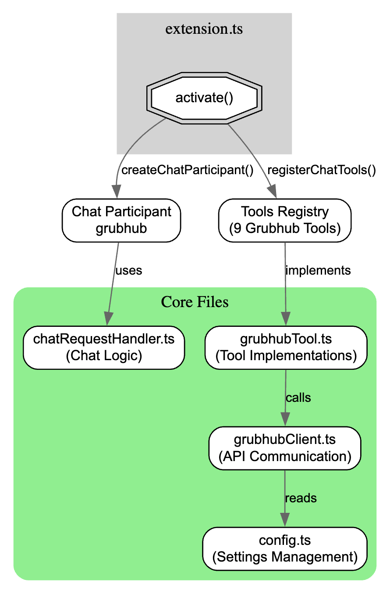
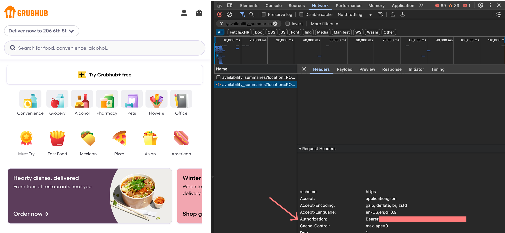
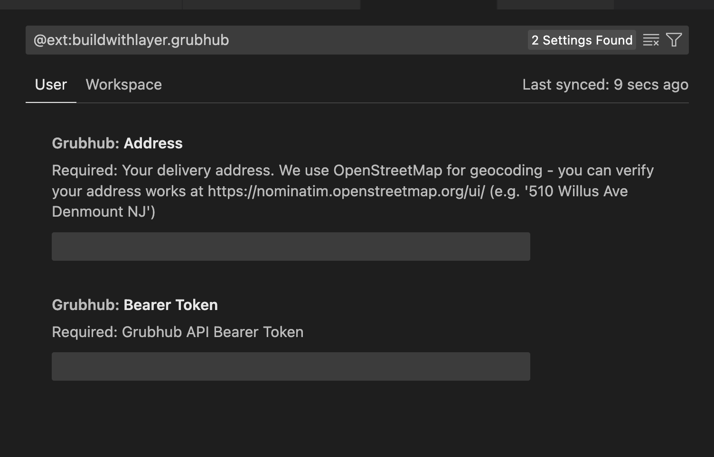

<head>
  <title>Layer AI Blog | Building a VSCode Chat Extension to Order Me Cheeseburgers</title>
  <meta property="og:title" content="Layer AI Blog | Building a VSCode Chat Extension to Order Me Cheeseburgers" />
</head>

Are you ever in the sigma developer grindset so hard that you forget to eat? Me neither. But like most VC backed companies, I will attempt to solve a problem that does not exist! In the process I hope you learn how to waste time as well as me while still getting paid.


## Where do we start? 

Let's look at the sophisticated technical architecture I will be using to accomplish this feat of engineering.

Here is the flow:
1. **VSCode Chat API:** Developer asks copilot to "Order lunch"
2. **LLM Determines tool Calls:** GET_LUNCH_OPTIONS
3. **Copilot Responds:** Copilot will list options from the restaurant for what they can order
4. **Developer responds:** "Cheeseburger"
5. **LLM Determines tool Calls:** ORDER_LUNCH_ITEM
6. **Copilot Responds:** "Your cheeseburger has been ordered sir"

## Reverse Engineering Grubhub API like a Sigma Developer

At first I wanted to use Doordash, but they use server-side rendering to display their menus which would make our jobs real hard.  So I settled on using Grubhub instead (and may I just say, this was the correct choice).  Now Grubhub doesn't have a public API for ordering food (they do have this [API](https://developer.grubhub.com/), but this is for merchants of which I am not), so we need to reverse engineer the API.  To do this I used Chrome Dev Tools & [Postman Interceptor](https://chromewebstore.google.com/detail/postman-interceptor/aicmkgpgakddgnaphhhpliifpcfhicfo?hl=en).  

### My first "accidental" cheeseburger

In order to intercept all the requests, I needed to reverse engineer the API: I had to place an order.  So with my postman interceptor listening and the company card details ready, I walked through the checkout process and clicked "Submit".  Suddenly hundreds of requests poured out of my computer. I then rapidly tried to cancel the order, but it was too late. The food arrived at my house 30 minutes later. Here it is in its full glory:

```
                            |\ /| /|_/|
                          |\||-|\||-/|/|
                           \\|\|//||///
          _..----.._       |\/\||//||||
        .'     o    '.     |||\\|/\\ ||
       /   o       o  \    | './\_/.' |
      |o        o     o|   |          |
      /'-.._o     __.-'\   |          |
      \      `````     /   |          |
      |``--........--'`|    '.______.'
       \              /
	    `'----------'`

I forgot to take a picture, enjoy this ascii art
```


The burger was as good as I had imagined it would be, especially since it was on the company dime. But more importantly, I had all the request information I needed to start the reverse engineering.  All in all it took me about 8 hours to distill only the necesary requests for placing and order. I found it only takes 4 POST and 1 PUT request on Grubhub to make an order.  To save you all the time, here they are:

1. **POST `/carts`:** This route creates a new cart on the user's account
2. **POST `/carts/{cart_id}/lines`:** This allows us to add an item to the cart we just created
3. **PUT `/carts/{cart_id}/delivery_info`:** This updates the delivery address for the cart
4. **POST `/carts/{cart_id}/payments`:** This attaches a payment method to the cart
5. **POST `/carts/{cart_id}/checkout`:** This places the order

Honestly, looking at it now, I am a bit disappointed that this took me 8 hours to figure out.  Now there are a few more routes we are going to add to make the VSCode checkout experience smoother, but these 5 routes are all you need to place an order using the Grubhub API.  You can find them in this postman collection if you are interested (nerd).

## VSCode Extension

So what next?  Well this header says "VSCode Extension", so I guess we can talk about that.  VSCode extensions are a bunch of TypeScript accessing a bunch of [APIs](https://code.visualstudio.com/api/get-started/your-first-extension).  You can actually start one with a single command here:

```
npx --package yo --package generator-code -- yo code`
```

Now you could start from scratch with the command above, but I suggest you just clone my [Grubhub project](https://github.com/andrewlayer/grubhub) and remove what you don't want. 

Let us step back for a moment and take a look at the full project structure:



If you take a close look at the diagram, you can see there are two parts to our extension.  The stuff that VSCode requires for us to render a participant. And the stuff required to call the tools / use the LLM.  For the former, I will refer you to these [docs](https://code.visualstudio.com/api/extension-guides/chat-tutorial) as they are pretty good.  The latter will be what I focus this blogpost on.

### How do we call an API with an LLM?

So function calling basically works like this:

<div style={{display: "flex", flexDirection: "column", gap: "16px"}}>
    <div style={{padding: "20px", backgroundColor: "#333", borderRadius: "10px"}}>
        <p style={{margin: "0px", fontWeight: "bold", color: "#58A6FF"}}>User:</p>
        <p style={{margin: "0px"}}>Hey LLM I have this function called add that takes parameters `{num1: int, num2: int}` only respond with JSON so I can parse it from the response. Please add 5 and 9</p>
    </div>
    <div style={{padding: "20px", backgroundColor: "#333", borderRadius: "10px"}}>
        <p style={{margin: "0px", fontWeight: "bold", color: "#12B981"}}>Assistant:</p>
        <code>{`{num1: 5, num2: 9}`}</code>
    </div>
</div>
<br/>

While the LLMs which produce these JSON schemas no longer need to be prompted as such, fundamentally this is how function calling works. Getting LLMs to produce domain specific languages is actually a super interesting concept, but we are trying to get some burgers 🍔 🍔 🍔.


Here is an example of one of the tool schemas for `/get_restaurant_items`:
```json
"inputSchema": {
	"type": "object",
	"properties": {
		"restaurant_id": {
			"type": "string",
			"description": "The ID of the restaurant"
		}
	},
	"required": ["restaurant_id"]
}

--> Expected response from LLM
{
  "restaurant_id": "38427391"
}
```

This response it easy to parse with `JSON.loads()` and then can be validated with something like [Zod](https://zod.dev) and [Pydantic](https://pydantic.dev) to ensure it is correct.  These tool schemas are declared in the `package.json` file in the extension which you can find [here](https://github.com/andrewlayer/grubhub/blob/main/package.json)!

### Function Calling ☎️
So now that we have our JSON, we need to use it to invoke a function. In the case of calling an API endpoint, that means we need to take our parameters and shove them into javascript `fetch`.  Here is how we got that done for `/get_restaurant_items`:

```typescript
export class GetRestaurantItemsTool implements vscode.LanguageModelTool<GetRestaurantItemsParameters> {
    async invoke(
        options: vscode.LanguageModelToolInvocationOptions<GetRestaurantItemsParameters>,
        _token: vscode.CancellationToken
    ) {
        try {
            const res = await grubhubClient.getRestaurantItems(options.input.restaurant_id);
            
            const itemsList = response.items.map(item => 
                `- ${item.item_name} (ID: ${item.item_id})\n
                  ${item.item_description || 'No description available'}`
            ).join('\n\n');

            return new vscode.LanguageModelToolResult([
                new vscode.LanguageModelTextPart(
                    itemsList || 'No items found'
                )
            ]);
        } catch (error) {
            return new vscode.LanguageModelToolResult([
                new vscode.LanguageModelTextPart(
                    `Failed to get restaurant items: ${error instanceof Error ? error.message : 'Unknown error'}`
                )
            ]);
        }
    }
}
```

In the code above, we implement the `vscode.LanguageModelTool` class which requires the `invoke` function.  This is ultimately what does the "calling" of the tool. In this line here:

```ts
const res = await grubhubClient.getRestaurantItems(options.input.restaurant_id);
```

You can see we get the restaurant ID.  You might be asking, "but sir 🧐 how did you parse the JSON?".  Well, you see, by implementing the language model tool class, this is done automatically for me as long as I provide a JSON schema!

## Workflows (a quick aside)
Now in order to make any agentic experience nice, you really need workflows.  *Why is this?* Well, let me show you a hypothetical conversation and see if you understand:

<div style={{display: "flex", flexDirection: "column", gap: "16px"}}>
    <div style={{padding: "20px", backgroundColor: "#333", borderRadius: "10px"}}>
        <p style={{margin: "0px", fontWeight: "bold", color: "#58A6FF"}}>Hungry Developer:</p>
        <p style={{margin: "0px"}}>Hey can you list my restaurants</p>
    </div>
    <div style={{padding: "20px", backgroundColor: "#333", borderRadius: "10px"}}>
        <p style={{margin: "0px", fontWeight: "bold", color: "#12B981"}}>AI (internally panicking):</p>
        <p style={{margin: "0px"}}>You need to make a session first before I can list your restaurants, let me do that.</p>
        <p style={{margin: "0px", fontStyle: "italic", color: "#777"}}>(frantically making API calls in the background)</p>
    </div>
    <div style={{padding: "20px", backgroundColor: "#333", borderRadius: "10px"}}>
        <p style={{margin: "0px", fontWeight: "bold", color: "#58A6FF"}}>Still Hungry Developer:</p>
        <p style={{margin: "0px"}}>ok can you do it now please</p>
    </div>
    <div style={{padding: "20px", backgroundColor: "#333", borderRadius: "10px"}}>
        <p style={{margin: "0px", fontWeight: "bold", color: "#12B981"}}>AI (sweating):</p>
        <p style={{margin: "0px"}}>Getting your favorite restaurants here they are:</p>
        <br/>
        ```
        • Restaurant 123421
        • Restaurant 60552
        • Restaurant 666
        ```
        <p style={{margin: "0px", fontStyle: "italic", color: "#777"}}>(nailed it! ...right?)</p>
    </div>
    <div style={{padding: "20px", backgroundColor: "#333", borderRadius: "10px"}}>
        <p style={{margin: "0px", fontWeight: "bold", color: "#58A6FF"}}>Hangry Developer:</p>
        <p style={{margin: "0px"}}>What?? I want the names of the restaurants, not their IDs 😡</p>
    </div>
    <div style={{padding: "20px", backgroundColor: "#333", borderRadius: "10px"}}>
        <p style={{margin: "0px", fontWeight: "bold", color: "#12B981"}}>AI (having an existential crisis):</p>
        <p style={{margin: "0px"}}>Ahhh I see, I need to get the names using this route for each ID. Here they are:</p>
        <br/>
        ```
        • Beighley's Burgers and Bananas
        • Jared's Jive
        • Dave's Delicious Driveway
        ```
        <p style={{margin: "0px", fontStyle: "italic", color: "#777"}}>(phew, crisis averted... until the next API call)</p>
    </div>
</div>
<br/>

The above conversation is the actual flow of API calls required for Copilot to list restaurants for Grubhub (moderately dramatized). This obviously isn't very user friendly. You see, most APIs our of the box are not ready to be used by AI agents because they provide bad UX and require additional information that us as users (and LLMs) don't care about.  Thus we must clean and simplify the API

So how can we accomplish these workflow. Well in this project, I hardcode them all.  But if you are interested in effortlessly cleaning your API for agents to use effectively... Allow me to introduce you to [Layer.](https://buildwithlayer.com/).

## Gosh are we done yet?
For the most part, yes. But don't you want to order some food? 

1. **Install the extension** [here](https://marketplace.visualstudio.com/items?itemName=buildwithlayer.grubhub).  This will open a tab in VSCode where you can then actually add the extension. 

2. **Get your bearer token & POINT**: Alright so I didn't handle auth well, this took me too long anyways.  you can get your bearer token and POINT by intercepting the `https://api-gtm.grubhub.com/restaurants/availability_summaries` request made as such:<br/>

3. Input those values into the VSCode Grubhub extension settings:<br/>

4. Restart VSCode et voilà 🎉!

You can now use the VSCode chat extension!  If for some reason you like my content, feel free to subscribe to my [newsletter](https://docs.google.com/forms/d/e/1FAIpQLSf4WGoin0w1eM5f9cwZ4kyd7ocx9i2uAmMVNPAj80_prSUHDg/viewform?usp=dialog).  I promise to sell your email to the highest bidder! (just kidding, it will stay with me).