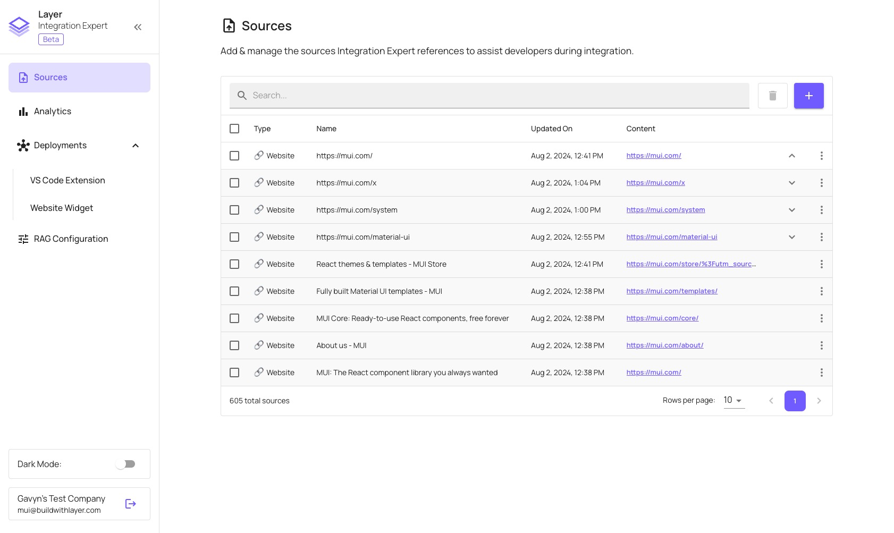

# Management Dashboard

The **Management Dashboard** is the central hub for managing and configuring all aspects of your LLM extensions.

From this dashboard, you can:

- **[Manage Knowledge Sources](/management-dashboard/sources)**: Upload and organize the resources that Layer will use to answer developer queries.
- **[Test Responses](/management-dashboard/rag-testing)**: See how your LLM extensions will reply based on the sources you've added and your RAG configuration settings.
- **[Fine-Tune the RAG](/management-dashboard/rag-config)**: If you aren't getting the responses you expect, you can adjust the RAG settings to improve them.
- **[Customize & Deploy Extensions](management-dashboard/deploying)**: Easily deploy AI-powered extensions to multiple platforms, such as VS Code, GitHub Copilot, and your website.
- **[Monitor Analytics](/management-dashboard/analytics)**: View insights on what developers are asking and identify pain points to continuously improve your documentation and product.
