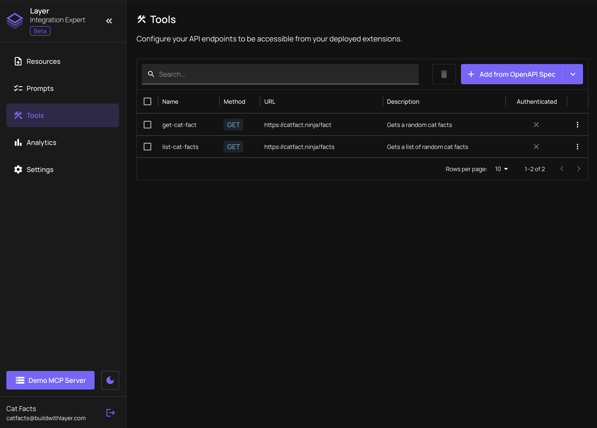

# Management Dashboard

The **Management Dashboard** is the central hub for creating, managing, and maintaining your MCP server using Layer.

From this dashboard, you can:

- **[Manage Resources](/management-dashboard/resources)**: Upload the resources (docs, files, GitHub content, etc.) that your MCP server will use to provide relevant context to agents.
- **[Define Tools](/management-dashboard/tools)**: Add structured API endpoints agents can call via MCP, using your OpenAPI spec or manual configuration.
- **[Author Prompts](/management-dashboard/prompts)**: Create workflows or instructional content that guides how agents interact with your product.
- **[Test with the Demo MCP Server](/management-dashboard/testing)**: Instantly test your server’s behavior in supported clients using your Layer-hosted demo server. For details about deploying a self-hosted MCP server, see **[MCP Server Generator](/generator)**.
- **[Monitor Analytics](/management-dashboard/analytics)**: Get insights into which tools and prompts users are accessing through your MCP server.

Use the dashboard to easily manage the content of your MCP server. As client support evolves, Layer automatically keeps your server aligned with the latest supported features.
